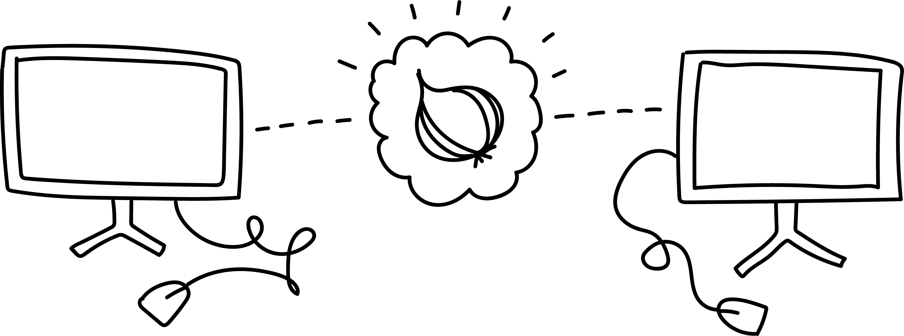

# Self-hosting websites with Tor

This repository is a developing guide to hosting websites using Tor, a privacy-centric and censorship-circumvention tool. It's divided into two sections:
  * `docs/`: the written guide available online at https://self-host.lizz.website
    * [`docs/content/index.md`](https://github.com/lizzthabet/self-hosting-with-tor/blob/main/docs/content/index.md): markdown version of the guide
  * `site/`: a sample site and files you can use to follow the guide

## Just for ease! Links for the HOPE 2024 workshop
* [Spreadsheet to add your onion url to](https://cryptpad.fr/sheet/#/2/sheet/edit/dhKYJzIPlJf+ZWsLe4rjA7uz/p/) ✎ let's make this onion ring!
* [Feedback survey](https://cryptpad.fr/form/#/2/form/view/wNqlvnRBSQag2Wc45mDptI+z8rT6bgBinqh7PNvFwNE/) ♡ feedback is a gift

### Plus, these are the tools we'll install
* [Tor Browser](https://torproject.org/download)
* [Brave Browser](https://brave.com/download)
* [OnionShare](https://onionshare.org/)
* [Tor](https://community.torproject.org/onion-services/setup/install) (aka little-t tor)
* [Tor Expert Bundle](https://torproject.org/download/tor/)
* [Self-hosting with Tor guide](https://self-host.lizz.website) (the online version, not the source code)

## About this guide *(excerpt)*
This guide is part of a larger, work-in-progress workshop series on Tor that explores how power is distributed in networking infrastructure and invests in more playful, DIY internets.

Technology skillshare is an exercise in imagination, since understanding how technologies came to be and how they operate is an opportunity to understand that they're not inevitable or permanent.

There are real alternatives that exist in the world right now, which present avenues, both material and ideological, for disinvesting from present conditions and systems of harm. Tor gives us a real strategy for navigating privacy, surveillance, and censorship on the internet today, as well as models for distributed stewardship of network infrastructure. It's an incomplete and imperfect tool, where we can practice skepticism and technology critique, while actively resisting the search for technological saviors.

This series has been developed with support from many brilliant and kind collaborators and teachers from [Collective Action School](https://school.logicmag.io), the [School for Poetic Computation](https://sfpc.study), and [Tech Learning Collective](https://techlearningcollective.com).

### I'd love your feedback
Feedback is a gift. :) You can reach out to me over email or raise an issue or pull request on this repo.
